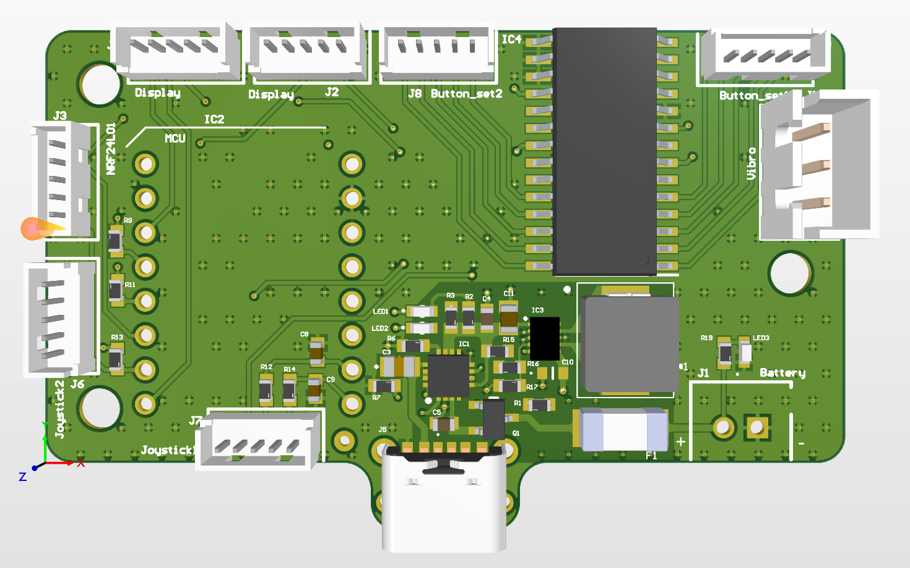

# Design-and-Development-of-a-Remote-Controller-for-an-RC-Vehicle
Custom microcontroller-based remote controller for an RC vehicle, featuring ESP32-C3, nRF24L01 wireless communication, TFT display, dual analog joysticks, programmable buttons, Li-Po battery management, USB-C charging.

# Remote Controller for RC Vehicle 🎮



[](https://www.altium.com/)
[](LICENSE)
[]()

A custom remote control hardware project designed for radio-controlled (RC) vehicles. This repository contains the complete design cycle: schematic, PCB layout, documentation, and manufacturing outputs.

---

## 🌟 Key Features

* **Wireless Communication:** 2.4 GHz NRF24L01 with up to 15 meters range.
* **Control Inputs:** 2 dual-axis gimbals, 12 toggle switches.
* **Display:** 0.96" OLED I2C / 1.8" TFT for telemetry and battery status.
* **Power System:** 1s Li-Po battery with buck-boost convertor and built-in USB-C charging circuitry.
* **Ergonomics:** Compact double-sided PCB optimized for 3D-printed enclosures.

---

## 🛠 Specifications

| Feature | Specification |
| :--- | :--- |
| **Microcontroller** |ESP32|
| **RF Module** | NRF24L01 |
| **Operating Frequency** | 2.4 GHz |
| **Supply Voltage** | 3.7V - 4.2V (Li-Po) |
| **Charging Interface** | USB Type-C |
| **Board Dimensions** | 59 x 32 mm |
| **PCB Layer Count** | 4 Layers |

---

## 📂 Repository Structure

```text
├── 3d_models/          # CAD models of enclosure & PCB (SolidWorks, STEP)
│   ├── board.SLDPRT
│   └── remote_control_assembly.SLDASM
├── docs/               # Schematics (PDF), datasheets, and specs
│   └── schematic.pdf
├── fabrication/        # Manufacturing outputs (Gerbers, NC Drill, BOM, Pick&Place)
├── hardware/           # Source EDA project files (KiCad/Altium)
│   └── project/        # PCB layout and schematic sources
├── images/             # Renders, PCB layer previews, and photos
│   ├── 3d-render.png
│   ├── top_3d_view.png
│   ├── bottom_3d_view.png
│   ├── top_layer_signal.png
│   ├── second_layer_gnd.png
│   ├── third_layer_power.png
│   └── bottom_layer_signal.png
├── software/           # Transmitter firmware source code
└── README.md           # Project overview and documentation